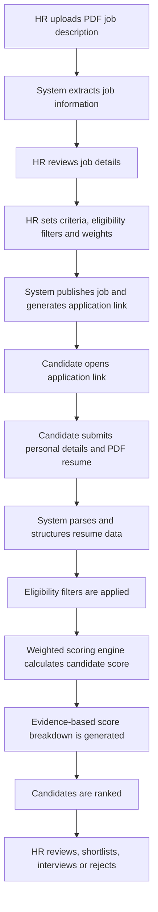
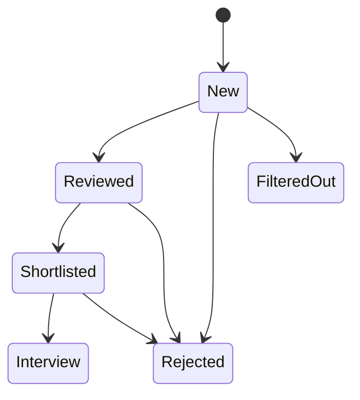
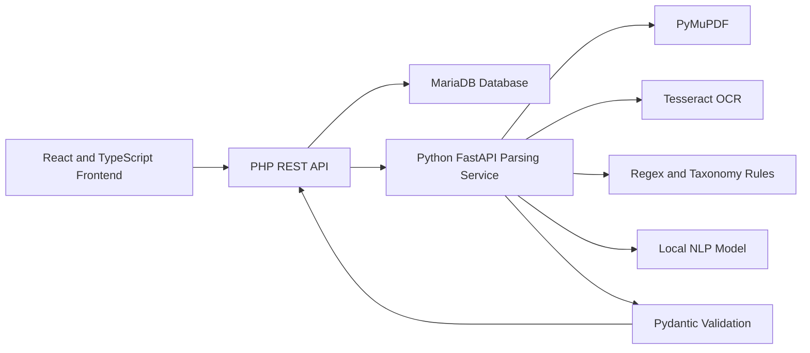

# AI-Based Human Resource Decision Support System

A web-based recruitment decision support system developed for UWC Berhad. The system centralizes job creation, candidate applications, resume evaluation, candidate ranking, and recruitment communication in one platform.

It is designed to reduce repetitive screening work while keeping the recruitment process transparent. The system supports HR decisions but does not make the final hiring decision automatically.

## Project highlights

* Supports 3 primary user roles: HR Staff, Hiring Manager, and Candidate
* Processes 2 document types: PDF resumes and PDF job descriptions
* Uses 2 parsing approaches: rule-based parsing and model-based parsing
* Applies 3 extraction techniques: Regex, taxonomy matching, and local NLP extraction
* Uses 1 unique application link for each published job
* Supports 6 candidate statuses: New, Reviewed, Shortlisted, Interview, Rejected, and Filtered Out
* Produces a weighted score breakdown for every evaluated candidate
* Keeps the final hiring decision under human control

No model accuracy figures are reported at the current development stage. Formal evaluation metrics will be added after the parsing pipeline and test dataset are finalized.

## Problem

Manual resume screening can take a large amount of time when HR staff receive many applications. Evaluation may also become inconsistent when different reviewers use different criteria.

Job descriptions and resumes usually contain unstructured text. Important information such as skills, education, work experience, projects, and job requirements must be identified before candidates can be compared fairly.

This project addresses these issues by providing a structured recruitment workflow with:

* Job description processing
* Candidate self-submission
* Configurable screening criteria
* Weighted candidate scoring
* Evidence-based score explanations
* Candidate ranking
* Human review and decision support

## Main workflow



## Core features

### 1. Job management

HR staff can:

* Create and manage job posts
* Upload PDF job descriptions
* Review extracted job information
* Edit job titles, descriptions, skills, and requirements
* Set eligibility filters
* Define screening criteria and weights
* Publish or close job posts
* Generate an application link for each job

### 2. Candidate application portal

Candidates can:

* Open a job-specific application link
* Enter personal and contact information
* Upload PDF resumes and supporting files
* Submit more than one application
* Receive submission confirmation
* View clear validation and error messages

Each application is connected to the correct job post through its unique link.

### 3. Resume and JD parsing

The planned parsing service uses Python FastAPI to process PDF resumes and job descriptions.

The document processing pipeline includes:

* PyMuPDF for text extraction from text-based PDFs
* Tesseract OCR as a fallback for scanned or low-text PDFs
* Regex for deterministic fields
* Taxonomy matching for known technical terms
* A local NLP model for more complex information
* Pydantic and JSON Schema for output validation

#### Rule-based parsing

Rule-based parsing is used for fields with clearer patterns, including:

* Email address
* Phone number
* LinkedIn profile
* GitHub profile
* CGPA
* Dates
* Notice period

Taxonomy matching is used for:

* Technical skills
* Programming languages
* Spoken languages
* Certifications

#### Model-based parsing

A local NLP model is planned for information that is harder to extract using fixed patterns, including:

* Education details
* Work experience
* Project information
* Responsibilities
* Job requirements

The final output is converted into structured JSON before it is passed to the scoring engine.

Example output:

```json
{
  "candidate": {
    "name": "Candidate Name",
    "email": "candidate@example.com",
    "phone": "0123456789",
    "cgpa": 3.45,
    "notice_period": "1 month"
  },
  "education": [],
  "experience": [],
  "projects": [],
  "skills": [],
  "languages": [],
  "certifications": []
}
```

## Weighted scoring and explainability

The system uses a rule-based weighted scoring engine.

HR staff define:

* Screening criteria
* Weight for each criterion
* Minimum eligibility requirements
* Job-specific expectations

The scoring engine compares structured candidate data against the HR-defined criteria.

```text
Weighted Criteria Score = Criteria Score x Criterion Weight
```

The candidate's final score is calculated from the total weighted criteria scores.

The explanation component records:

* Matched requirements
* Missing requirements
* Evidence found in the resume
* Score for each criterion
* Weight assigned by HR
* Contribution of each criterion to the final score

Example:

```text
Technical Skills
Matched: React, TypeScript and MySQL
Missing: Docker
Criteria Score: 75
Weight: 40%
Weighted Score: 30
```

This allows HR staff to understand why a candidate received a particular score instead of viewing only a final number.

## Eligibility filtering

Eligibility filters are separate from weighted scoring.

Examples include:

* Minimum CGPA
* Required education level
* Maximum notice period
* Mandatory qualification

A candidate who does not meet a mandatory requirement can be labelled as `Filtered Out`.

The candidate's evaluation details may still be stored for transparency but the candidate is excluded from the main ranked list.

## Candidate status workflow



Supported statuses:

| Status       | Meaning                                               |
| ------------ | ----------------------------------------------------- |
| New          | A new application has been submitted                  |
| Reviewed     | HR has opened and reviewed the candidate details      |
| Shortlisted  | The candidate has been selected for further review    |
| Interview    | An interview invitation has been sent                 |
| Rejected     | The candidate has been rejected                       |
| Filtered Out | The candidate did not meet an eligibility requirement |

## Recruitment communication

The system supports recruitment communication through:

* Interview invitation emails
* Rejection emails
* Reusable email templates
* Email logs
* Notification history
* Supporting file attachments
* HR action history

These functions allow HR staff to manage candidate communication from the same system.

## Dashboard and analytics

The dashboard provides recruitment information such as:

* Total applicants
* Active jobs
* Candidate status distribution
* Recent applications
* Average candidate score
* Recruitment activity

The project also includes HR workflow analytics and activity tracking.

Attendance analytics is treated as an optional feature and is not part of the core AI resume screening scope.

## User roles

### HR Staff

HR Staff can:

* Create and manage jobs
* Upload job descriptions
* Configure criteria and weights
* Generate application links
* Review candidates
* View score breakdowns
* Shortlist candidates
* Send interview and rejection emails

### Hiring Manager

Hiring Managers can:

* Review ranked candidates
* View shortlisted candidates
* Inspect candidate evidence
* Review score breakdowns
* Support the final hiring decision

### Candidate

Candidates can:

* Open a shared application link
* Submit personal information
* Upload a PDF resume
* Upload supporting documents
* Receive application confirmation

## System architecture



The architecture separates the system into 4 main technical areas:

1. Frontend interface
2. Core REST API
3. AI document parsing service
4. Database and persistent storage

## Technology stack

### Frontend

* React 19
* TypeScript 5.8
* Vite 6
* Tailwind CSS 4
* Radix UI
* React Router 7
* Recharts
* Lucide React

### Backend

* Native PHP REST API
* PHP 8.2
* Python FastAPI parsing service

### AI and document processing

* PyMuPDF
* Tesseract OCR
* Regex
* Keyword taxonomy matching
* Local NLP model
* Pydantic
* JSON Schema

### Database

* MariaDB
* MySQLi
* phpMyAdmin

### Development tools

* Visual Studio Code
* XAMPP
* Git
* GitHub
* Figma

## Local development setup

### Prerequisites

Install the following tools:

* Node.js 20 or later
* npm 10 or later
* XAMPP with Apache, PHP and MariaDB
* Git
* Python 3.10 or later for the parsing service
* Tesseract OCR for scanned PDF support

### 1. Clone the repository

```bash
git clone https://github.com/KhawVicky/HR-System.git
cd HR-System
```

### 2. Install frontend dependencies

```bash
npm install
```

### 3. Copy the PHP API to XAMPP

Create this directory:

```text
C:\xampp\htdocs\uwc-hr-api
```

Then run:

```bash
npm run dev:api
```

This copies:

```text
server/api.php
```

to:

```text
C:\xampp\htdocs\uwc-hr-api\api.php
```

### 4. Start XAMPP

Start:

* Apache
* MySQL

The PHP API will be available at:

```text
http://localhost/uwc-hr-api/api.php
```

### 5. Start the frontend

```bash
npm run dev
```

The frontend will run on a local Vite development address such as:

```text
http://localhost:5174
```

### 6. Build for production

```bash
npm run build
```

### 7. Preview the production build

```bash
npm run preview
```

## Project status

| Area                                   | Status                          |
| -------------------------------------- | ------------------------------- |
| React and TypeScript interface         | Implemented                     |
| PHP REST API integration               | Implemented                     |
| MariaDB database integration           | Implemented                     |
| Job and candidate pages                | Implemented                     |
| Candidate application workflow         | Implemented                     |
| Candidate status actions               | Implemented                     |
| Interview and rejection email workflow | Implemented                     |
| Notifications and email logs           | Implemented                     |
| HR activity and efficiency analytics   | Implemented                     |
| Real JD information extraction         | In development                  |
| Real resume field extraction           | In development                  |
| FastAPI parsing service                | In development                  |
| OCR fallback pipeline                  | Planned for parsing integration |
| Local NLP extraction                   | Planned for parsing integration |
| Production-ready authentication        | In development                  |
| Formal parsing accuracy evaluation     | Not started                     |
| Report export                          | Planned                         |

## Current scope

The current AI scope focuses on:

* PDF resumes
* PDF job descriptions
* Text-based PDFs
* Scanned PDFs
* Low-text PDFs
* Hybrid rule-based and model-based parsing
* Structured JSON output
* HR-defined weighted scoring
* Evidence-based explanations
* Candidate ranking
* Human-controlled recruitment decisions

## Limitations

* Only PDF resumes and job descriptions are supported in the current scope.
* Parsing quality may depend on document quality, writing style, and layout.
* Scanned documents require OCR and may contain recognition errors.
* The system does not guarantee correct extraction from every resume layout.
* No parsing accuracy claim is made before formal evaluation.
* The scoring engine depends on criteria and weights configured by HR.
* The system does not make autonomous hiring decisions.
* The current project is an advanced academic prototype rather than a full commercial recruitment platform.

## Future improvements

* Complete the FastAPI parsing service
* Add confidence scores for extracted fields
* Add source text evidence for every extracted field
* Evaluate parsing performance using an annotated dataset
* Improve multi-column resume reading order
* Add layout-aware document processing
* Add secure password hashing and server-side role authorization
* Add model and scoring rule version tracking
* Add HR correction feedback for parsed information
* Add production deployment, HTTPS, backups, and monitoring

## Decision support principle

This project follows a human-in-the-loop approach.

The system can:

* Extract information
* Apply HR-defined rules
* Calculate scores
* Rank candidates
* Present evidence
* Support review

The system cannot:

* Hire a candidate automatically
* Reject a candidate without HR action
* Replace professional HR judgment

The final recruitment decision remains with authorized HR staff and hiring managers.

## Project information

| Item             | Details                                         |
| ---------------- | ----------------------------------------------- |
| Project          | AI-Based Human Resource Decision Support System |
| Type             | Final Year Project                              |
| Industry partner | UWC Berhad                                      |
| Developer        | Vicky Khaw Wei Kee                              |
| Student ID       | 0209031                                         |
| Programme        | Bachelor of Computer Science                    |
| Institution      | University of Wollongong Malaysia               |
| Supervisor       | Dr. Wong Khang Siang                            |

## License

This repository is developed for academic and educational purposes. Project content, data, and source code should not be reused for commercial purposes without permission.
